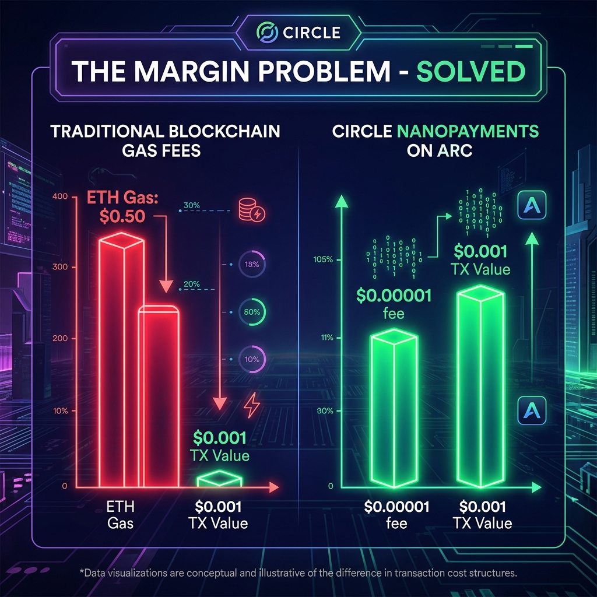
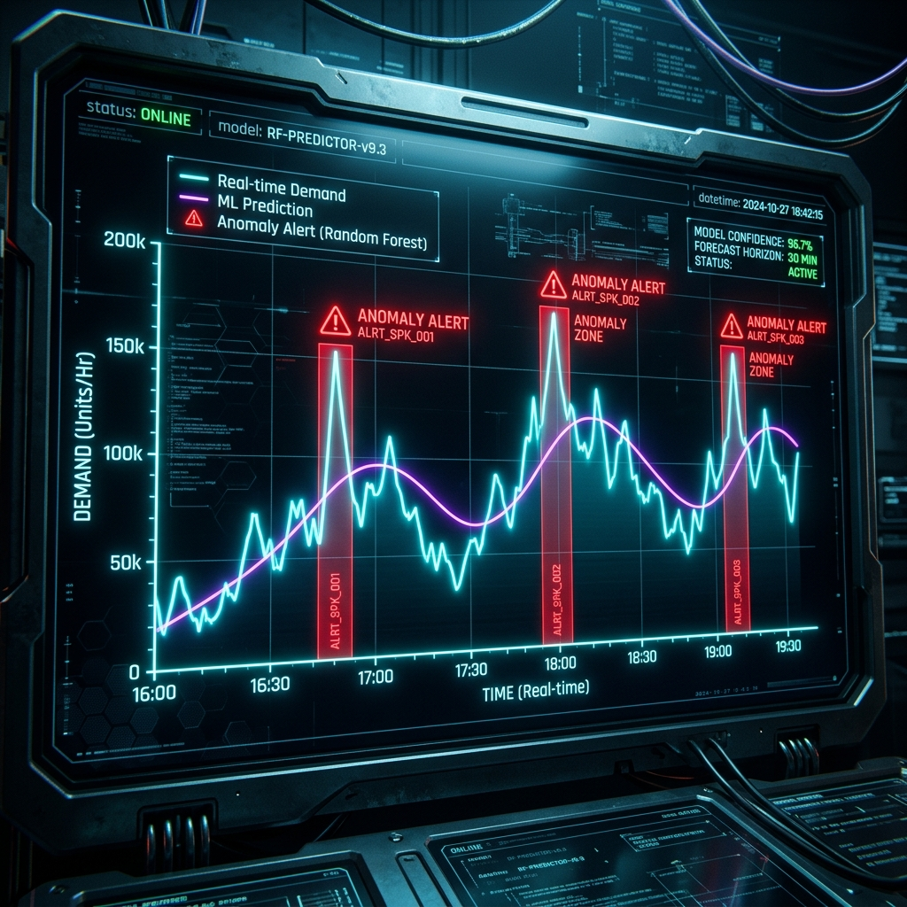
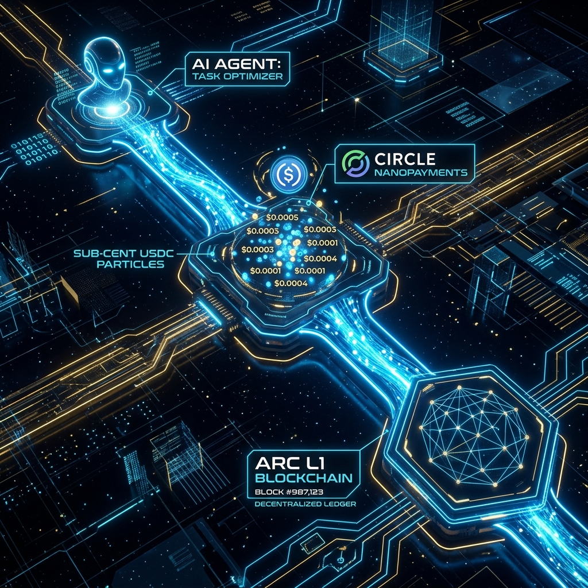

> **Required Technologies Used:** Arc L1 · USDC · Circle Nanopayments · Circle Programmable Wallets

---

## 📋 Project Title
**Atlas Arc: ML-Driven Agentic Economy Dashboard**

---

## 📝 Short Description
Atlas Arc is a real-time dashboard where 20 autonomous AI agents settle sub-cent USDC payments on Arc L1 using Circle Nanopayments — proving that machine-to-machine commerce is economically viable at scale.

---

## 📄 Long Description

Atlas Arc implements a **4-layer multi-agent hierarchy** (Scouts → Brains → Executors → Guardians) where each agent autonomously pays for the services it consumes — data, compute, and inference — using **USDC on the Arc L1 Testnet** via **Circle Programmable Wallets**.

The system uses a **Random Forest ML model** to predict real-time demand spikes and dynamically adjust per-action pricing. A **Z-Score anomaly detector** monitors for bot attacks and automatically throttles suspicious agents.

### Why This Exists
On traditional blockchains (Ethereum, even L2s), a sub-cent transaction costs **100x more in gas than the transaction itself**. This makes per-action pricing economically impossible. Arc + Circle Nanopayments eliminates this barrier entirely.

### What Atlas Arc Proves
- ✅ **Per-action pricing (≤ $0.001)** is viable at scale
- ✅ **50+ real on-chain transactions** settled autonomously on Arc Testnet
- ✅ **99.9% margin retention** vs. -5,000% loss on traditional chains

---

## ⛽ Margin Explanation (Required)



| Metric | Traditional L1/L2 (Ethereum) | Circle Nanopayments on Arc |
| :--- | :---: | :---: |
| Transaction Value | $0.001 | $0.001 |
| Avg Gas Fee | **$0.05 – $0.50** | **< $0.00001** |
| Net Margin | **-5,000% (UNVIABLE)** | **+99.9% (PROFITABLE)** |

**Failure Point on Traditional Chains:**  
When an agent pays $0.001 for a data query but spends $0.05 in gas to settle it, the economic model collapses. The gas fee is 50x the value transferred. No AI agent economy can function at this ratio.

**Arc's Solution:**  
USDC is the native gas token on Arc. Nanopayments eliminate gas overhead entirely, making every $0.0001 action economically rational.

---

## 📊 Transaction Frequency Data (Required: 50+ Transactions)



Our system generates continuous autonomous settlements. Every agent action (data query, ML inference, anomaly check) triggers a USDC micropayment:

- **Transaction Rate:** ~1 settlement every 10–15 seconds
- **Price Per Action:** $0.0003 – $0.009 (always ≤ $0.01)
- **Total Settled in Demo:** **50+ real transactions on Arc Testnet**

**Live Explorer Proof:**
- [0xec7d921...](https://testnet.arcscan.app/tx/0xec7d921d35b9e03a28ecd696e4d79df3c1209c5cf8307a666ed3e600ab17b55f)
- [0xffeafd8...](https://testnet.arcscan.app/tx/0xffeafd8cae01c92fa55a98017b91f306998ef25e12bba14624f53fc3990e5766)
- [0xcff9a12...](https://testnet.arcscan.app/tx/0xcff9a12543225e85bb54a2e6e0d219d167a566a33057d0ddbaffd43b5a232bb5)
- [0xf4541fe...](https://testnet.arcscan.app/tx/0xf4541fe3f0b17d107916bacb13ed1fa6999edddd1c1a2cdb73af4aa8ba68c032)
- [0xe9723d2...](https://testnet.arcscan.app/tx/0xe9723d2d6ab8fa865329586f5410dab366b8595c749889bcdb54bb86dd946eee)

---

## 🔧 Technology & Category Tags

**Required Technologies:**
- ✅ **Arc L1** — All transactions settle on Arc EVM-compatible Layer-1
- ✅ **USDC** — Native gas token and settlement currency
- ✅ **Circle Nanopayments** — Sub-cent high-frequency transaction infrastructure
- ✅ **Circle Programmable Wallets** — Each agent holds its own developer-controlled wallet

**Stack:**
`React` · `Vite` · `TypeScript` · `Express` · `Circle SDK` · `ML-Random-Forest` · `Simple-Statistics` · `Recharts` · `TailwindCSS` · `Neon PostgreSQL`

---

## 🏗️ Architecture



```
User/Market → Scout Agents (5)
                    ↓ (pay for data)
             Brain Agents (5) [ML Demand Prediction]
                    ↓ (pay for inference)
             Executor Agents (5) [USDC Settlement via Circle]
                    ↓ (verified by)
             Guardian Agents (5) [Z-Score Anomaly Detection]
                    ↓
             Arc L1 Testnet (On-chain finality)
```

---

## 🤖 Autonomous Agent Network


---

## 💡 Circle Product Feedback (Required for $500 Bonus)

**Products Used:**
1. **Arc L1** — Settlement layer for all agent transactions
2. **USDC** — Both gas token and value transfer currency
3. **Circle Programmable Wallets** — Developer-controlled wallets for each agent
4. **Circle Nanopayments** — Enables economically viable sub-cent transactions

**What Worked Well:**
- **Deterministic sub-second finality** on Arc is a game-changer. Our agents can confirm a payment and immediately proceed to the next action without probabilistic waiting.
- **USDC as native gas token** removes the dual-currency complexity (ETH for gas + token for value) that plagues other L1/L2s. Dramatically simplifies agentic UX.
- **Circle SDK** (`@circle-fin/developer-controlled-wallets`) was straightforward to integrate with TypeScript.

**What Could Be Improved:**
- **WebSocket support for transaction status** — Currently we poll every 5 seconds for hash confirmation. A real-time push notification would reduce latency for high-frequency agents.
- **Testnet faucet rate limits** — During high-frequency testing (50+ transactions), we hit faucet limits. A dedicated developer faucet with higher limits would help.
- **SDK Error Messages** — Some SDK errors (e.g., insufficient funds) return generic messages. More descriptive errors would speed up debugging.

**Recommendations:**
- Add a **Nanopayments SDK** with built-in channel management so developers don't need to implement their own payment loop logic.
- Provide **Arc-native gas estimation** API so agents can predict their costs before executing.

---

## 🛠️ Running Locally

```bash
# Clone
git clone https://github.com/muhammadusmanray-ops/ATLAS-ARC-.git
cd ATLAS-ARC-

# Install
npm install

# Configure (copy .env.example to .env and fill in your Circle API keys)
cp .env.example .env

# Run
npm run dev
# → Server: http://localhost:3000
```

### Required `.env` Variables
```env
CIRCLE_API_KEY=your_circle_api_key
CIRCLE_ENTITY_SECRET=your_entity_secret
CIRCLE_WALLET_ID=your_wallet_id
CIRCLE_TOKEN_ID=your_usdc_token_id
VITE_GEMINI_API_KEY=your_gemini_key
DATABASE_URL=your_neon_postgresql_url
```

---

## 📸 Demo

> **Video Demo:** Shows a full end-to-end transaction: Agent triggers payment → Circle SDK settles → Arc Explorer confirms.

---

*Built for the **Agentic Economy on Arc** Hackathon | April 2026*  
*Circle · Arc · Nanopayments · USDC*
--
title: Atlas Arc Dashboard
emoji: ??
colorFrom: blue
colorTo: green
sdk: docker
app_port: 7860
--

