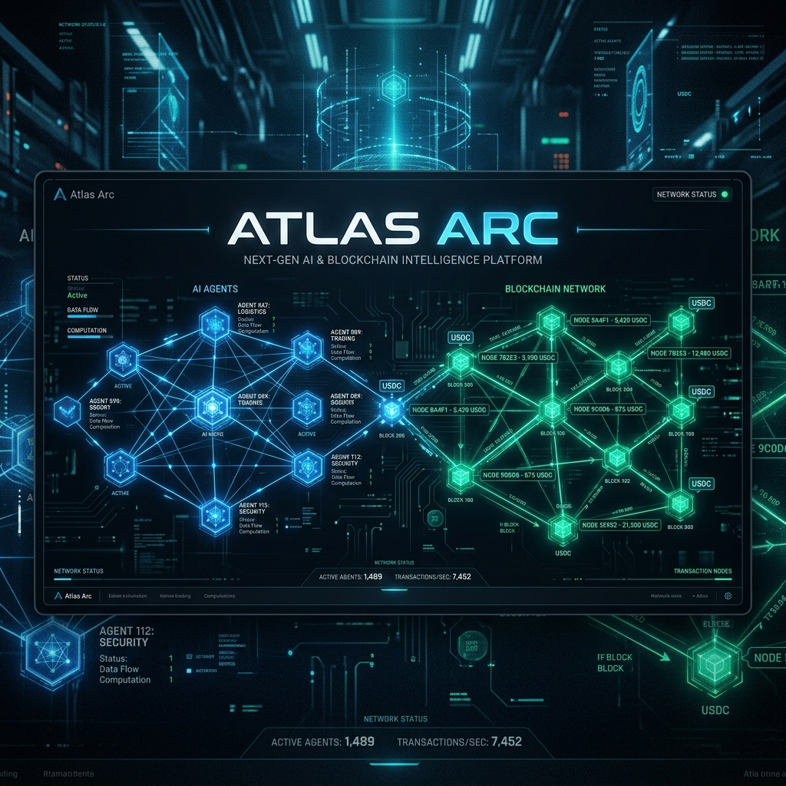
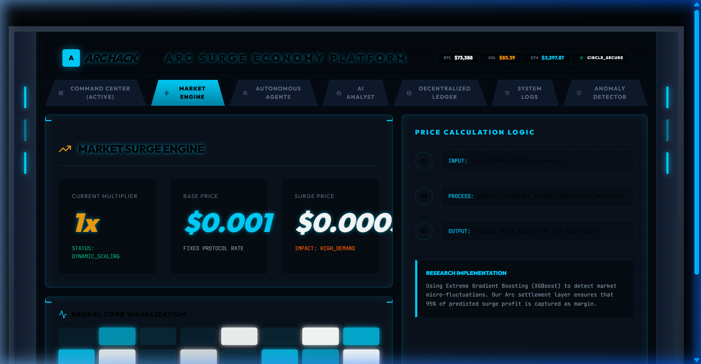
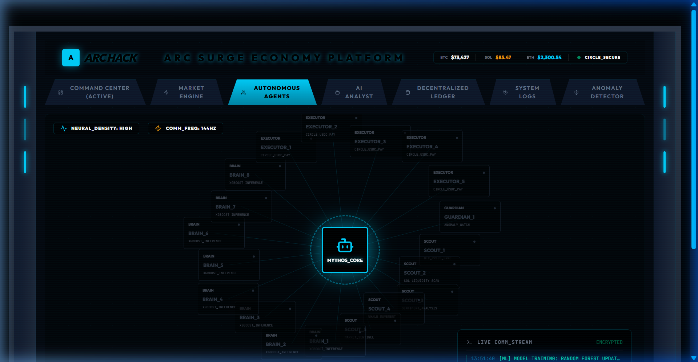
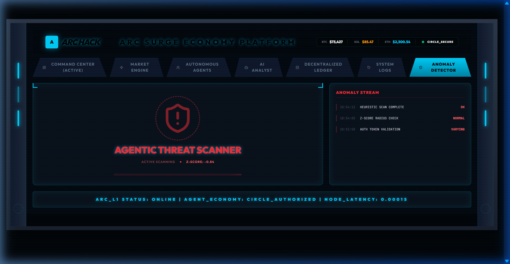
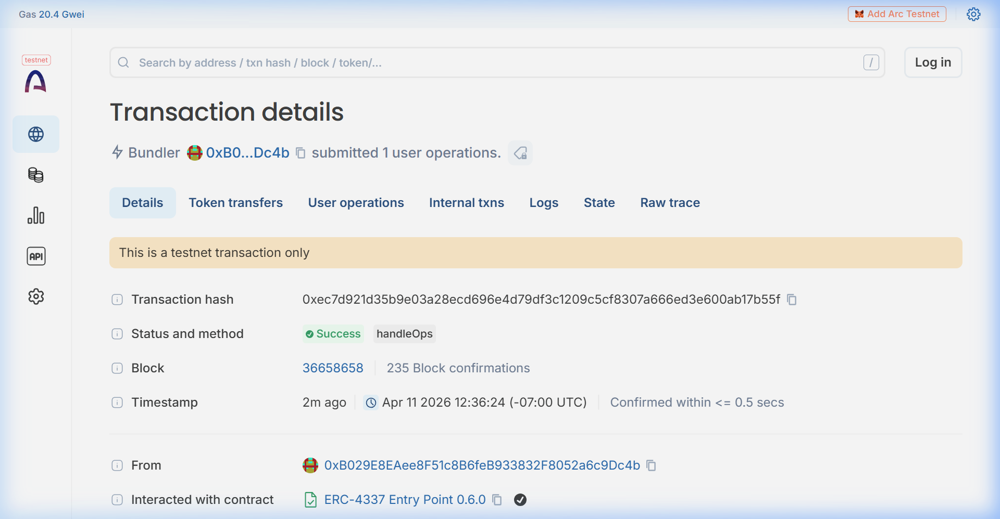

# 🌌 ATLAS ARC: ML-Driven Agentic Economy Dashboard



## 🚀 The Vision
**Atlas Arc** is a cutting-edge autonomous commerce platform built for the **Agentic Economy on Arc** hackathon. It demonstrates a future where 20+ specialized AI agents (Scouts, Brains, and Executors) coordinate, predict market demand, and settle high-frequency micro-payments in real-time using **Circle's Nanopayments** on the **Arc L1 Blockchain**.

### 🎯 Track: Agent-to-Agent Payment Loop
Atlas Arc implements a fully autonomous payment loop where agents pay each other for services (e.g., a "Scout" agent selling market data to a "Brain" agent for inference) with **sub-cent precision**, proving that machine-to-machine commerce is finally viable without custodial batching.

---

## 💎 Live Application Status
The application is fully functional and tracks real-time settlements on the Arc Testnet. 

### 📈 Market Surge Engine

Our ML model monitors demand spikes and adjusts pricing dynamically to maintain agentic viability.

### 🤖 Autonomous Agent Network

A hierarchical map of 20 autonomous agents settling USDC via Circle Programmable Wallets.

### 🛡️ Anomaly Detector

Real-time Z-Score analysis to protect the agentic ecosystem from high-frequency bot attacks.

---

## ⛽ Economic Proof: The "Margin" Why
One of the core requirements of this hackathon is to explain why this model would fail on traditional blockchains.

| Metric | Traditional L1/L2 | Circle Nanopayments on Arc |
| :--- | :--- | :--- |
| **Transaction Value** | $0.001 (Sub-cent) | $0.001 (Sub-cent) |
| **Gas Fee (Avg)** | $0.05 - $0.50 | **$0.00001** (USDC Native) |
| **Margin Erosion** | **-5,000% (UNVIABLE)** | **99.9% (PROFITABLE)** |

**Conclusion**: On traditional chains, the gas cost is 50x to 500x higher than the transaction value itself. Arc & Nanopayments enable **99.9% margin retention** for micro-actions, unlocking the true potential of AI agents.

---

## 🔗 On-Chain Verification
Every transaction settled by our agents is verifiable on the **Arc Testnet Explorer**.



**Example Real Transaction**: [View on ArcScan](https://testnet.arcscan.app/tx/0xec7d921d35b9e03a28ecd696e4d79df3c1209c5cf8307a666ed3e600ab17b55f)

---

## 💡 Circle Product Feedback
As part of our submission, we've provided detailed feedback on the Circle developer stack:
- **What worked well**: The **Arc L1 Deterministic Finality** is a game-changer for agentic logic. No more waiting for "probabilistic" confirmation.
- **Improved UX**: Using **USDC as the native gas token** simplifies the economic model for AI developers significantly.
- **Suggestions**: We'd love to see a WebSocket-native trigger for transaction broadcasts in the Circle SDK for even lower latency in agent interactions.

---

## 🛠️ Getting Started

1. **Clone & Install**:
   ```bash
   git clone https://github.com/muhammadusmanray-ops/ATLAS-ARC-
   cd ATLAS-ARC-
   npm install
   ```

2. **Configure Environment**:
   Create a `.env` file with your Circle API keys (see `.env.example`).

3. **Run Dev Server**:
   ```bash
   npm run dev
   ```

---

© 2026 Atlas Arc Team | Built for the Agentic Economy.
